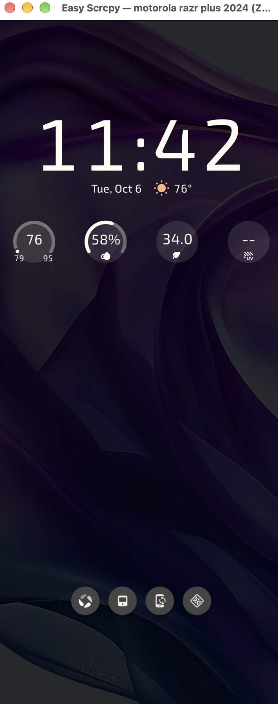

# Easy Scrcpy

<a id="english"></a>

[English](#english) | [简体中文](#简体中文)

An independent GUI and system tray companion for [Genymobile/scrcpy](https://github.com/Genymobile/scrcpy), without modifying its mirroring core. Supports Windows, macOS, and Ubuntu.

## In action



See the [screenshot gallery](wiki/README.md) for the device panel, tray menu, mirroring prompt, settings, and multiple-device mirroring.

## Features

- Runs in the menu bar / system tray. Closing the panel keeps the app running; quitting stops all mirroring sessions started by this app.
- Asynchronously detects USB Android devices through ADB every 2 seconds. Wi-Fi devices and emulators are not treated as USB devices.
- Asks whether to start mirroring once a device is authorized, only once per connection. You can also start manually after declining.
- Mirrors multiple devices in separate scrcpy processes and windows. Stop individual sessions or all sessions at once.
- Stops the corresponding session when a USB device is unplugged or goes offline. Force-kills it if graceful termination times out, without killing unrelated processes or the global ADB server.
- Configurable ADB / scrcpy paths, connection prompts, resolution, frame rate, and audio forwarding.
- Per-device quality selection in the device panel, saved across launches: Smooth (1024 / 30 FPS / 2 Mbps), Standard (1920 / 60 FPS / 8 Mbps), High quality (original resolution / 60 FPS / 16 Mbps), Custom, or Global settings. Resolution values limit the mirrored image's maximum dimension, not the phone's display resolution. Changing quality during mirroring restarts only that device and never disables USB debugging. Use **Adjust…** to set maximum dimension, frame rate, and bit rate.
- Optional **Try to disable USB debugging when stopping mirroring** (off by default): manual Stop / Stop all first sends an ADB disable request, then stops mirroring. Failures or a 3-second timeout still stop mirroring and show a warning. Disconnect cleanup and quitting do not change phone settings. Some phones deny the request; even a successful command requires checking on the phone. Disabling USB debugging affects all ADB connections to that phone, and you must manually re-enable it on the phone for the next session.
- Login startup for the current user: macOS LaunchAgent, Windows HKCU Run, and Ubuntu XDG autostart.
- Single-instance lock, logs, and missing-dependency / mirroring error messages. Keeps the main window open if the system tray is unavailable.
- English, Simplified Chinese, French, German, and Japanese. Defaults to the system language, falling back to English for other languages. Choose **Settings → Language** and save to update the interface, tray menu, and pending mirroring prompts immediately, without restarting. Historical logs and raw scrcpy / ADB output are not translated.

## Requirements

The packaged app does **not** require a separate Python, ADB, or scrcpy installation. Development and building require Python 3.10+. Your phone must run Android 5.0 or later, with developer options and **USB debugging** enabled. Authorize the computer's RSA key on the phone when connecting for the first time. Audio forwarding requires Android 11 or later.

**Enabling developer mode alone is not enough. ADB cannot enable USB debugging through a debugging connection that does not yet exist, nor bypass authorization.** Phones without USB debugging may not appear in the device list. Linux USB permissions and Windows OEM USB drivers must also be configured correctly.

The app bundles the official portable release of **scrcpy 5.0 + ADB 37.0.1**, including the Android server and companion libraries. It does not download dependencies at startup or when mirroring. Tool lookup order: explicitly configured path → bundled version → system PATH / common SDK locations (development fallback). Normally, no path configuration is needed.

Bundled tools do not replace device drivers: some Windows phones still need OEM USB drivers, and Ubuntu still needs USB permissions / udev rules. Desktop graphics libraries and GPU drivers are operating system dependencies.

## Development

Run from the project directory:

```bash
python3 -m venv .venv
# macOS / Ubuntu
source .venv/bin/activate
# Windows PowerShell: .venv\Scripts\Activate.ps1
python -m pip install -e .
python packaging/prepare_runtime.py
python -m easy_scrcpy
```

Or use uv:

```bash
uv sync
uv run python packaging/prepare_runtime.py
uv run python -m easy_scrcpy
```

Start with the main window hidden: `python -m easy_scrcpy --background`.

Login startup depends on the installation / virtual environment staying at the same path. On macOS, the setting takes effect at the next login and does not start a second instance immediately. Some Ubuntu GNOME environments need the AppIndicator extension to show tray icons. On Wayland, the desktop environment controls whether prompts receive focus.

## Tests

```bash
python -m unittest discover -s tests -v
```

For headless Qt integration tests, set `QT_QPA_PLATFORM=offscreen`. Tests use simulated subprocesses, require no phone, and do not change your actual login startup configuration.

## Updating bundled scrcpy / ADB (maintainers)

```bash
# Preview the latest official stable release without changing files
uv run python packaging/update_scrcpy.py
# Apply: update pinned versions, SHA-256 hashes, third-party notices, and local tools
uv run python packaging/update_scrcpy.py --apply
# Choose a version and prepare all supported platforms
uv run python packaging/update_scrcpy.py --version 5.0 --all-targets --apply
# Test and rebuild
uv run --extra build python -m unittest discover -s tests -v
uv run --extra build python -m PyInstaller --noconfirm packaging/EasyScrcpy.spec
```

You can use `python` instead of `uv run python`. The script only accesses official GitHub / Google download sources. Versions and checksums come from the official release API and build scripts at the corresponding tag; upstream scripts are not executed. Set `GITHUB_TOKEN` if you encounter GitHub API rate limits.

Use `--target <platform-architecture>` multiple times to select additional platforms. Existing supported platforms in `vendor/` are updated too, preventing stale bundles. All downloads are verified and prepared in a temporary directory before project files are replaced. Original dependencies and configuration are preserved in `.cache/backups/`; replacement failures roll back changed files without deleting originals. The script does not update installed apps or `dist/`: rebuild afterward. Do not run it concurrently with a build. Missing upstream assets / checksums or changed build-script formats cause an error requiring manual review.

## Packaging

Build on each target operating system; PyInstaller does not directly support cross-OS builds:

```bash
python -m pip install -e '.[build]'
python -m PyInstaller --noconfirm packaging/EasyScrcpy.spec
```

The build script downloads official portable releases and verifies the SHA-256 hashes pinned in `packaging/dependencies.json`. It retains all release files and ADB's original NOTICE. Prepared tools live in `vendor/<platform-architecture>/`, and downloads are cached in `.cache/downloads/`. Neither is committed to Git. Repeated builds verify prepared files and refuse to overwrite a different version or modified dependencies.

Output is in `dist/`. Distribute the complete directory or macOS `.app`, not just the executable. The macOS app runs in the menu bar rather than staying in the Dock. Supported targets: macOS Apple Silicon / Intel, Windows x64 / ARM64, and Ubuntu x64. Ubuntu ARM64 has no upstream official portable bundle and produces an explicit build error. Build using Python for the matching architecture.

Manually trigger `.github/workflows/build.yml` to build on all three operating systems and upload bundled test artifacts; it does not automatically publish releases. Before public distribution, arrange macOS signing / notarization and Windows signing, and supply corresponding source code, relinking materials for statically linked LGPL dependencies, and complete license texts. See `packaging/THIRD_PARTY_NOTICES.md`.

Settings and rotating logs are stored in Qt's user configuration directory:

- macOS: `~/Library/Preferences/EasyScrcpy/EasyScrcpy/`
- Windows: `%LOCALAPPDATA%/EasyScrcpy/EasyScrcpy/`
- Ubuntu: `~/.config/EasyScrcpy/EasyScrcpy/`

Device disconnections are usually detected in about 2 seconds, plus normal ADB query time. Failed queries preserve the previous device state to avoid stopping active sessions incorrectly. USB bandwidth and host encoding / decoding load can affect performance when multiple devices are connected.

This is an unofficial GUI. Copyright and licenses for scrcpy and related components belong to their respective authors. The app's `runtime/` directory retains the original LICENSE, `licenses/platform-tools-NOTICE.txt`, third-party notices, and dependency checksum manifest.

---

<a id="简体中文"></a>

# Easy Scrcpy · 简体中文

[English](#english) | [简体中文](#简体中文)

基于 [Genymobile/scrcpy](https://github.com/Genymobile/scrcpy) 的独立 GUI / 托盘助手，不修改 scrcpy 的投屏核心。支持 Windows、macOS、Ubuntu。

## 运行演示


更多截图：查看 [运行截图文档](wiki/README.md)，包含设备面板、托盘菜单、投屏确认、设置及多设备投屏。

## 功能

- 菜单栏 / 系统托盘常驻，关闭面板不退出；通过“退出”停止所有由本应用启动的投屏。
- 每 2 秒通过 ADB 异步检测 USB Android 设备，不把 Wi-Fi 设备和模拟器作为 USB 设备。
- 设备完成授权后询问是否投屏，同一次连接只询问一次；拒绝后可手动启动。
- 多台设备各自启动一个 scrcpy 进程与投屏窗口，支持独立停止或全部停止。
- USB 拔出 / 设备离线后停止对应进程；正常停止超时后强制结束，不杀其他应用的进程或全局 ADB 服务。
- 设置 ADB / scrcpy 路径、连接提示、分辨率、帧率和音频转发。
- 设备面板支持每台设备独立选择画质并记住选择：流畅（1024 / 30 FPS / 2 Mbps）、标准（1920 / 60 FPS / 8 Mbps）、高清（原始分辨率 / 60 FPS / 16 Mbps）、自定义，或跟随全局设置。数值是最大画面边长，不会改变手机屏幕分辨率。投屏中修改会只重启对应设备，不触发关闭 USB 调试；“调整…”可设置最大边长、帧率和码率。
- 可选“停止投屏时尝试关闭 USB 调试”（默认关闭）：手动停止 / 停止全部时先通过 ADB 请求关闭，再清理投屏；失败或 3 秒超时也照常停止并提示。拔线清理和退出应用不修改手机设置。部分手机会拒绝请求，返回成功也需在手机上检查；成功关闭会影响该手机所有 ADB 连接，下次投屏须在手机上手动开启 USB 调试。
- 当前用户登录自启动：macOS LaunchAgent、Windows HKCU Run、Ubuntu XDG autostart。
- 单实例锁、运行日志、依赖缺失和投屏错误提示。托盘不可用时保留主窗口。
- 英语、简体中文、法语、德语、日语；默认跟随系统（其他系统语言回退英语）。在“设置 → 语言”选择，保存后立即更新界面 / 托盘 / 待确认投屏弹窗，无需重启。历史日志和 scrcpy / ADB 原始输出不翻译。

## 前置条件

安装打包应用不需要 Python、ADB 或 scrcpy。开发 / 构建需要 Python 3.10+。手机 Android 5.0+，开启开发者选项与 **USB 调试**，首次连接在手机上确认电脑 RSA 授权。音频转发需要 Android 11+。

**仅开启开发者模式不够，ADB 无法通过尚未建立的调试连接开启 USB 调试或绕过授权。** 未开启 USB 调试的手机可能不出现在设备列表中。Linux 的 USB 权限和 Windows 的 OEM USB 驱动也需要正确配置。

安装包内置官方便携版 **scrcpy 5.0 + ADB 37.0.1**，包括 Android 服务端和配套动态库。启动 / 投屏时不下载依赖。优先级：设置中的显式路径 → 内置版本 → 系统 PATH / 常见 SDK 路径（开发环境兜底）。通常无需填写路径。

内置依赖不等于内置驱动：Windows 个别手机仍需 OEM USB 驱动；Ubuntu 仍需 USB 访问权限 / udev 规则。桌面图形库和 GPU 驱动属于操作系统依赖。

## 开发运行

在项目目录运行：

```bash
python3 -m venv .venv
# macOS / Ubuntu
source .venv/bin/activate
# Windows PowerShell 使用：.venv\Scripts\Activate.ps1
python -m pip install -e .
python packaging/prepare_runtime.py
python -m easy_scrcpy
```

或使用 uv：

```bash
uv sync
uv run python packaging/prepare_runtime.py
uv run python -m easy_scrcpy
```

隐藏主窗口启动：`python -m easy_scrcpy --background`。

登录自启动需保持安装位置 / 虚拟环境路径不变。macOS 开关对下次登录生效，不启动第二个实例。Ubuntu GNOME 某些环境需安装 AppIndicator 扩展才能显示托盘，Wayland 下弹窗是否获得焦点由桌面环境决定。

## 测试

```bash
python -m unittest discover -s tests -v
```

无显示器环境可用 `QT_QPA_PLATFORM=offscreen` 运行 Qt 集成测试。测试使用模拟子进程，不需要手机，也不改变真实自启动配置。

## 更新内置 scrcpy / ADB（维护者）

```bash
# 查询官方最新稳定版，仅预览，不修改文件
uv run python packaging/update_scrcpy.py
# 确认更新：同步锁定版本、SHA-256、第三方版本声明和本机依赖
uv run python packaging/update_scrcpy.py --apply
# 指定版本 / 一次准备所有平台
uv run python packaging/update_scrcpy.py --version 5.0 --all-targets --apply
# 验证后重新打包
uv run --extra build python -m unittest discover -s tests -v
uv run --extra build python -m PyInstaller --noconfirm packaging/EasyScrcpy.spec
```

也可用 `python` 代替 `uv run python`。脚本仅访问官方 GitHub / Google 下载源；版本与校验信息来自官方发布 API 和对应 tag 的构建脚本，不执行上游脚本。GitHub API 限流时可设置 `GITHUB_TOKEN`。

`--target <平台-架构>` 可重复指定；已有的受支持 `vendor/` 平台会一并更新，避免残留旧版本。先在临时目录完整下载、校验、准备，再替换项目文件。原依赖及配置保留在 `.cache/backups/`；失败时恢复已替换文件，不删除原文件。脚本不更新已安装应用或 `dist/`，需要重新打包；构建期间请勿同时运行更新脚本。上游缺少资产 / 校验值或构建脚本格式改变时会报错，要求人工检查。

## 打包

分别在目标操作系统构建（PyInstaller 不能直接跨系统打包）：

```bash
python -m pip install -e '.[build]'
python -m PyInstaller --noconfirm packaging/EasyScrcpy.spec
```

构建脚本自动下载官方便携版并按 `packaging/dependencies.json` 中锁定的 SHA-256 校验；保留全部发布文件及 ADB 原始 NOTICE。依赖准备在 `vendor/<平台-架构>/`，缓存位于 `.cache/downloads/`，均不提交到 Git。重复构建会校验已准备文件，不覆盖不同版本或被修改的依赖。

输出在 `dist/`，必须分发完整目录 / macOS `.app`，不是单独一个可执行文件。macOS 应用为菜单栏应用，不常驻 Dock。支持 macOS Apple Silicon / Intel、Windows x64 / ARM64、Ubuntu x64；Ubuntu ARM64 暂无上游官方便携包，构建会明确报错。需使用相应架构的 Python 构建。

`.github/workflows/build.yml` 可手动触发三平台构建，并上传内置依赖的构建产物供测试（不自动发布）。正式公开发布前需处理 macOS 签名 / 公证、Windows 签名，补齐静态 LGPL 依赖的对应源代码 / 可重链接材料与完整许可证；详见 `packaging/THIRD_PARTY_NOTICES.md`。

设置及轮转日志存放在 Qt 的用户配置目录：
- macOS：`~/Library/Preferences/EasyScrcpy/EasyScrcpy/`
- Windows：`%LOCALAPPDATA%/EasyScrcpy/EasyScrcpy/`
- Ubuntu：`~/.config/EasyScrcpy/EasyScrcpy/`

设备断开响应通常在 2 秒左右，ADB 正常查询需少量额外时间；查询失败时保留之前状态，避免误杀仍在投屏的设备。设备数量较多时 USB 带宽和电脑编码 / 解码负载会影响性能。

本项目是非官方 GUI，scrcpy 及相关组件版权和许可证属于各自作者。安装包的 `runtime/` 内保留原始 LICENSE、`licenses/platform-tools-NOTICE.txt`、第三方声明及依赖校验清单。
