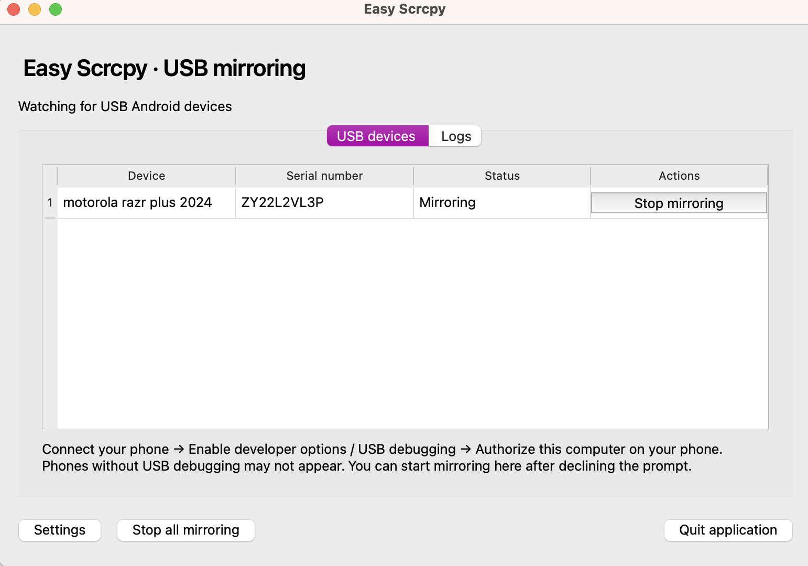
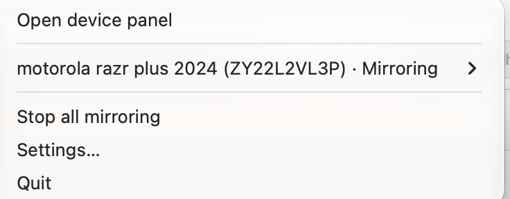
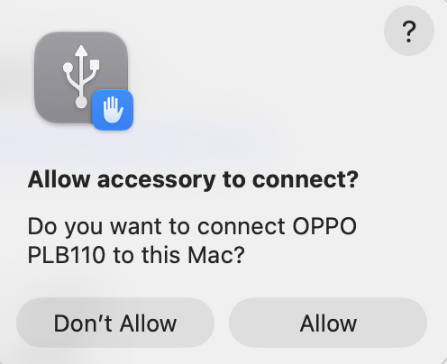
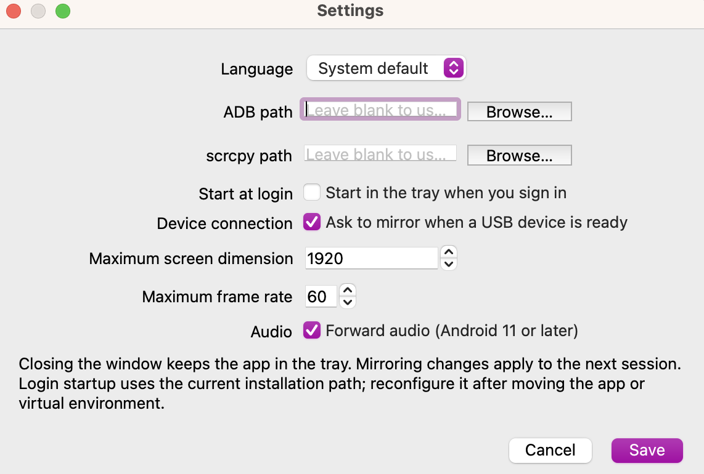

# 运行截图 / Screenshots

运行截图存放在 [`images/`](images/) 目录。

Application screenshots are stored in [`images/`](images/).

| 文件名 / Filename | 内容 / Content |
| --- | --- |
| `device-panel.png` | 主界面与设备列表 / Main window and device list |
| `tray-menu.png` | 状态栏或系统托盘菜单 / Menu bar or system tray menu |
| `mirror-prompt.png` | 设备连接后询问是否投屏 / Mirroring confirmation prompt |
| `setting.png` | 设置页面，包括语言和登录自启动 / Settings, including language and login startup |
| `multi-device.png` | 多台设备同时投屏 / Multiple devices mirroring simultaneously |
| `running.png` | 实际运行画面 / Application in action |

## 运行画面 / In action

## 设备面板 / Device panel

## 托盘菜单 / Tray menu

## 投屏确认 / Mirroring prompt

## 设置 / Settings

## 多设备投屏 / Multiple-device mirroring

## 添加截图 / Adding screenshots

可以只提供已有场景的截图，无需全部齐备。截图中请隐藏设备序列号、个人信息及敏感内容。

Only include screenshots of available scenarios. Hide device serial numbers, personal information, and sensitive content.

不同平台截图可放在 `images/macos/`、`images/windows/`、`images/ubuntu/` 子目录中，使用相同文件名。

For platform-specific screenshots, use `images/macos/`, `images/windows/`, or `images/ubuntu/` with the same filenames.

这是仓库内的文档目录，不是 GitHub 单独托管的 Wiki 仓库。添加或更换截图时，请同步更新本页的文件名和展示链接。

This directory is part of the project repository, not GitHub's separately hosted Wiki repository. When adding or replacing screenshots, update the filenames and image links on this page.
